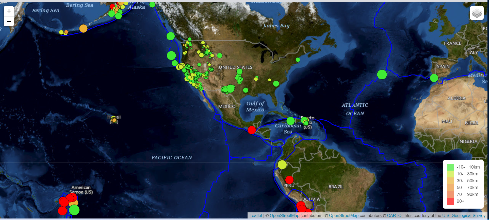
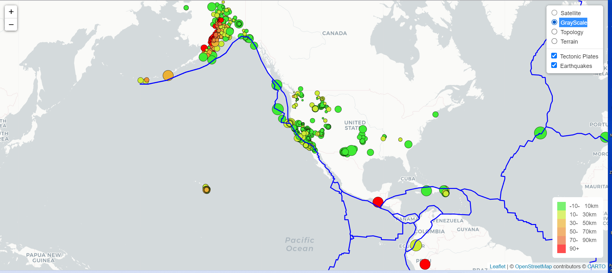

# Leaflet Homework: Visualizing Data with Leaflet

## Background

Welcome to the United States Geological Survey, or USGS for short. The USGS is responsible for providing scientific data about natural hazards, the health of our ecosystems and environment; and the impacts of climate and land-use change. Their scientists develop new methods and tools to supply timely, relevant, and useful information about the Earth and its processes. As a new hire, you will be helping them out with an exciting new project!

The USGS is interested in building a new set of tools that will allow them to visualize their earthquake data. They collect a massive amount of data from all over the world each day, but they lack a meaningful way of displaying it. Their hope is that being able to visualize their data will allow them to better educate the public and other government organizations (and hopefully secure more funding) on issues facing our planet.

### Task

### Level 1: Basic Visualization

First task was to visualize an earthquake data set.

1. **Get the data set**

   

   The USGS provides earthquake data in a number of different formats, updated every 5 minutes. Accessed [USGS GeoJSON Feed](http://earthquake.usgs.gov/earthquakes/feed/v1.0/geojson.php) page and chose "All Earthquakes from the Past 7 Days" data set to visualize. The URL of this JSON was used to pull in the data for visualization.

2. **Import & Visualize the Data**

   * Created a map using Leaflet that plots all of the earthquakes from the data set based on their longitude and latitude.

   * Data markers reflect the magnitude of the earthquake by their size and and depth of the earthquake by color. Earthquakes with higher magnitudes should appear larger and      earthquakes with greater depth should appear darker in color.

   * Popups provide additional information about the earthquake when a marker is clicked.
   * Click toggle in upper right hand corner to view different maps, tectonic plates and earthquakes options.

   * Created a legend that provides context for the map data.

   

- - -

### Level 2: More Data

* Data on tectonic plates found at <https://github.com/fraxen/tectonicplates>.

* Plot a second data set on map.

* Added a number of base maps to choose from as well as separate out our two different data sets into overlays that can be turned on and off independently.

* Added layer controls to map.

- - -

___
© 2021  Trilogy Education Services, a 2U, Inc. brand. All Rights Reserved.	
